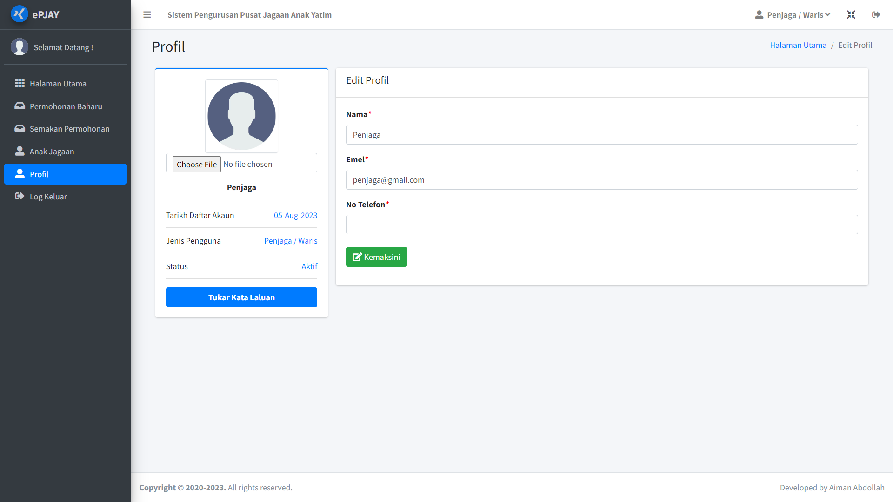

# Introduction

The <b>Orphanage Center Management System <i>(e-PJAY: Sistem Pengurusan Pusat Jagaan Anak Yatim)</i></b> is a web-based management information system designed to assist staff in improving the efficiency of managing information related to the <b>application process for orphanage admission, resident information management</b> and <b>financial transaction for income and expense</b>. This system developed as my Final Year Project for the Bachelor of Software Engineering (Information System Development) and was implemented through a case study. The system's users include admin, staff and guardians. The development of this system utilizes the <b>Laravel</b> framework with a <b>MySQL</b> database, while the waterfall model serves as the software development methodology.

# Problem Statement
Inefficient information management within an organization led to difficulties in obtaining information quickly and made updating and modifying records challenging when necessary (Mauliana et al., 2020). Problems identified included time-consuming manual submission of admission applications, resulting in delays and incomplete information. Orphan profiles were not updated regularly, making it challenging for previous guardians to stay informed about the children's status. Moreover, manual financial management led to excessive paper usage and required extensive physical storage of records, causing delays in retrieving information. Therefore, the development of this system simplified the application process and allowed applicants to check the status online. Staff could easily record, search and update orphan information regularly. The system also provided a visualization display of total expenses and income to assist staff in financial planning.

# List of Features

### Guardian / Normal User
- <b>View Dashboard:</b> Access a dashboard to have a quick view about statistics of applications submitted.
- <b>Submit Admission Applications:</b> Easily submit applications for the admission of orphans by online.
- <b>Check Application Status:</b> Track the progress and status of submitted applications.
- <b>Download Offer Letters:</b> Obtain offer letters for successfully admitted orphans.
- <b>View Orphan Information:</b> Access information and profiles of orphans under their guardianship.
- <b>Update Profile Information and Password:</b> Manage their personal profile and password settings securely.

### Staff
- <b>View Dashboard:</b> Access a comprehensive dashboard with relevant statistics and information.
- <b>Approve Applications:</b> Review and approve admission applications from guardians.
- <b>Confirm Registrations:</b> Confirm the registration of newly admitted orphans into the system.
- <b>Manage Orphan Information:</b> Efficiently manage the information and records of all orphans in the orphanage.
- <b>Manage Income/Expense Records with Categories:</b> Record and categorize income and expense transactions for proper financial management.
- <b>Download Reports on Orphans, Applications, Income, and Expenses:</b> Generate and download reports for better insights into orphanage operations.
- <b>Update Profile Information and Password:</b> Maintain staff profiles and password details securely.

### Admin
- <i>all staff functionalities can be accessed by the admin.</i>
- <b>Manage System Users:</b> Manage user accounts details within the system.
- <b>Update System Information:</b> Modify and update system information and logo.
- <b>Update Orphanage Information:</b> Manage essential information related to the orphanage.

# System Interface

### Guardian / Normal User
<table>
  <tr>
    <td>Dashboard</td>
    <td>Make New Application</td>
  </tr>
  <tr>
    <td></td>
    <td></td>
  </tr>
  <tr>
    <td>View Application Result</td>
    <td>View Orphan Information</td>
  </tr>
  <tr>
    <td></td>
    <td></td>
  </tr>
  <tr>
    <td>Edit Profile</td>
    <td>Change New Password</td>
  </tr>
  <tr>
    <td></td>
    <td></td>
  </tr>
 </table>

### Staff
<table>
  <tr>
    <td>Dashboard</td>
    <td>List of Application Approval</td>
  </tr>
  <tr>
    <td></td>
    <td></td>
  </tr>
 
  <tr>
    <td>List of Application Record</td>
    <td>List of Orphans</td>
  </tr>
  <tr>
    <td></td>
    <td></td>
  </tr>
  <tr>
    <td>Edit Orphan Information</td>
    <td>View Income Report List</td>
  </tr>
  <tr>
    <td></td>
    <td></td>
  </tr>
 </table>

 ### Admin
<table>
  <tr>
    <td>Dashboard</td>
    <td>List of Categories</td>
  </tr>
  <tr>
    <td></td>
    <td></td>
  </tr>
 
  <tr>
    <td>List of Users</td>
    <td>Configuration</td>
  </tr>
  <tr>
    <td></td>
    <td></td>
  </tr>
  <tr>
    <td>Edit System Information</td>
    <td>Edit Orphanage Information</td>
  </tr>
  <tr>
    <td></td>
    <td></td>
  </tr>
 </table>

 # System Testing

 ### Unit Testing
The screenshots below show the output of the unit tests for some scenarios, indicating whether each test has passed successfully or requires further attention. The successful completion of unit tests provides confidence in the system's functionality and adherence to the specified requirements, contributing to the development of this system.

<table>
  <tr>
    <td></td>
    <td></td>
  </tr>
 </table>

# Conclusion
In conclusion, the development of this sytem would be beneficial for the staff at the orphanage by facilitating quicker and more organized for processing of admission applications. Applicants or guradians can access information about registered orphans without the need to contact the management. For future improvements, this system can include automated notifications for application status updates via email or SMS, adding an academic module for examination results, and integrating a secure online payment system for orphanage expenses. Hopefully, this system can serve as a platform to streamline communication and coordination between guardians and orphanage staff, ultimately contributing to more efficient and effective orphan care.
 

